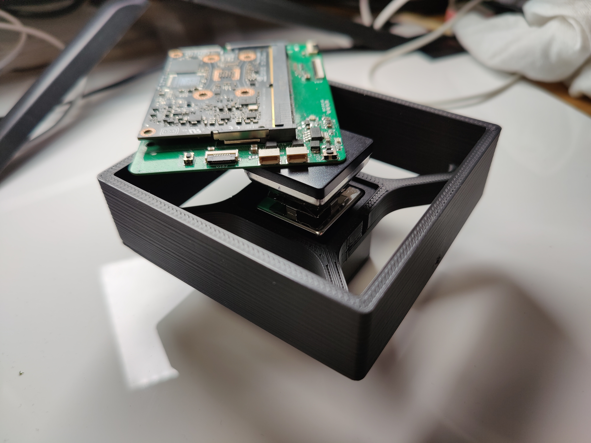
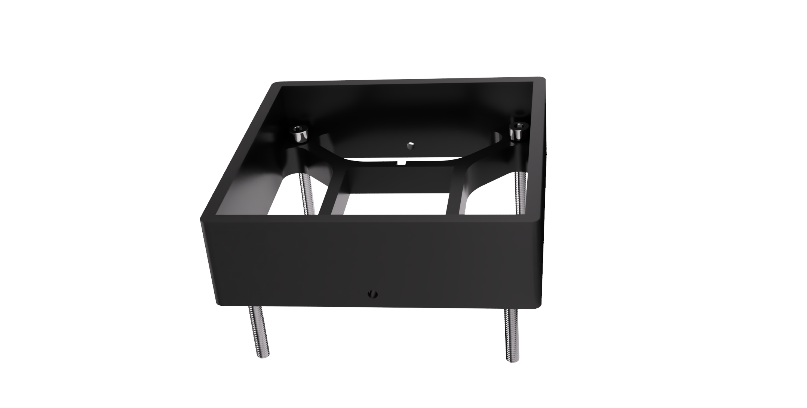

A simple design to extend the work surface of your MHP30 hotplate to do localized rework of large PCBs.
You can buy the hotplate itself here (affiliate): https://s.click.aliexpress.com/e/_AqqMTh
The Fusion design is parametrized, you can increase the size of it easily by adjusting the user parameter `cageDistance`.

