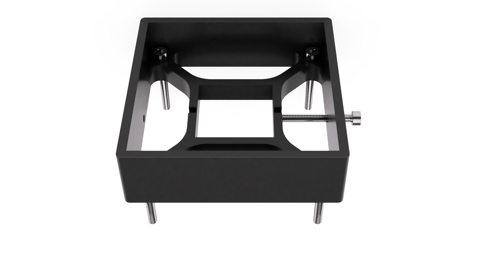

A simple design to extend the work surface of your MHP30 hotplate to do localized rework of large PCBs.
You can buy the hotplate itself here (affiliate): https://s.click.aliexpress.com/e/_AqqMTh
The Fusion design is parametrized, you can increase the size of it easily by adjusting the user parameter `cageDistance`.

The current design uses M4 bolts everywhere (previously M3). The bolts are totally optional, depending on the tolerance of your printer it should work fine with the press fit. You can increase the press fit tightness with some tape if necessary.

